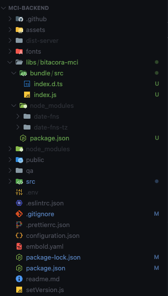

# bitacora-mci

## Description

Bitacora MQ Library is a library that allows you to register payload in a queue MQ, it is a library that is used in the Bitacora MQ application to log events and actions in HANA.

Do not modify the following files:

- .gitignore
- \*.js

## Installation

- main project: Project or microservice that will use the library.
- library: Bitacora MCI.

1. Create the bundle of the library (In this project):

```bash
npm install
npm run build
```

Note: It will generate the dist folder with the compiled code, you need to delete the dist folder before running the build command.

2. Copy the following files to the main project at root level (the same as package.json):

- bundle/
- package.json
- README.md

3. Add in package.json dependencies of the main-project:

```bash
"bitacora-mci": "file:./libs/bitacora-mci",
```

4. Install the dependencies of the main project:

```bash
npm install
```

Note: It will generate the node_modules folder with the dependencies of the main project and the library and in the node_modules folder of the library.

5. Import the library as:

```javascript
import { registrar } from "bitacora-mci";
```

# Evidence of the successful installation


